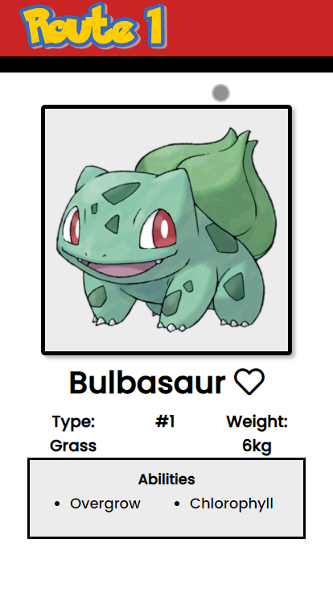
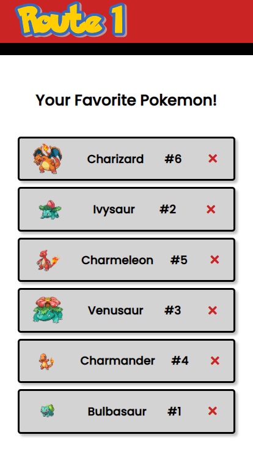
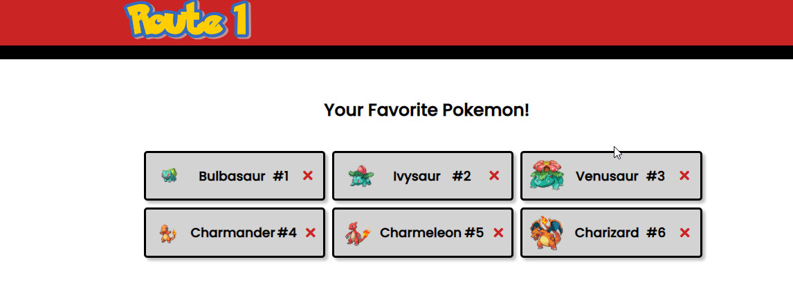
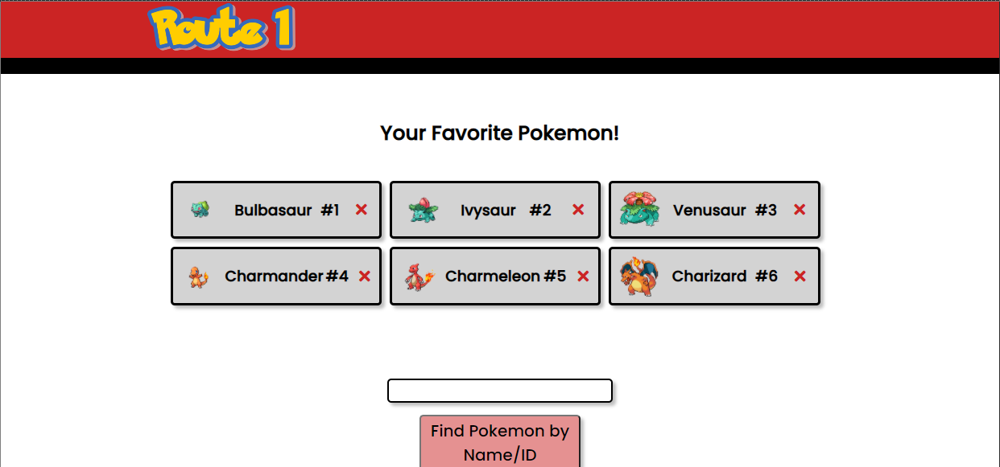

# Route 1

An application that lets the user find more information on their favorite pokemon!
It will also let the users find a random pokemon and add any pokemon to a list of favorites.
It pulls pokemon information from https://pokeapi.co/ and uses HTML5, CSS3 and JavaScript.

## Features

1) Users can view a Pokemon by searching by Name or Pokemon ID.
2) Users can view a Random Pokemon.
3) Users can add Pokemon that they have searched, or randomized, to their list of favorites.
4) Users are able to view a list of their favorite Pokemon.
5) Users can remove Pokemon from their Favorite Pokemon list.

### Planned Features
1) Users are able to search for moreinformation of their favorite pokemon by clicking the listed pokemon on their Favorites list
2) Users are able to make a "Trainer List" of 6 pokemon that they would take on their journey
3) Users are able to search for Pokemon based on Type.

#### What I learned from this project:
1) CSS is very important, not only is it used to format the page but it should be used to amplify the User-Experience by using pseudo-classes when certain items are in focus/hovered/active.
2) A project like this requires a really good API. If the format/data-structure of an API is terrible, the app is going to be either really messy or just equally as terrible as the API that it is built around.
3) Data-models should be used as much as possible. It helps with unloading/loading pages, it will also help with user-exerience such as creating user related list.

#### Screenshots

